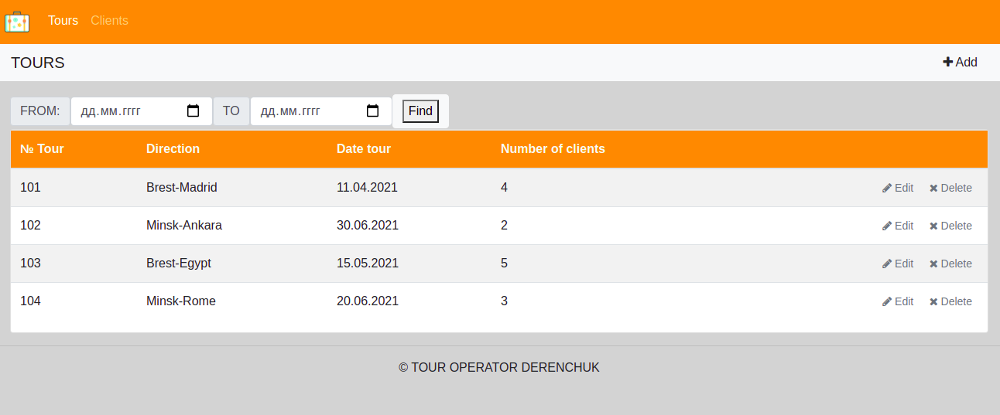

Функциональная спецификация программы «туры и клиенты».

# Туры и клиенты
##  Видение проекта  
Требуется создать рабочий прототип Web приложения для бронирования туров и контроля количества людей, забронировавших туры.
Приложение должно реализовывать следующие функции:

- Просмотр списка туров и редактирование этого списка.
- Отображение количества клиентов, забронировавших тур.
- Выбор туров, используя фильтр по дате.
- Просмотр списка клиентов и редактирование этого списка.

**1. Туры**

*1.1 Просмотр списка туров*

- Данный режим приложения позволяет просматривать список туров, а так же количества забронированных мест
  на каждый тур (отображаются колонки «№ com.aderenchuk.brest.model.Tour», «From/There», «Date tour», «Number of clients»).
 

*1.2 Добавление тура*

*Сценарий добавления нового тура:*

- В режиме просмотра списка туров, пользователь нажимает клавишу «+Add»

- Отображается режим добавления тура.

- Пользователь вводит данные (номер тура, откуда/куда и дату вылета) и нажимает «Save».

- Если данные введены корректно, то тур добавляется в базу данных.

- Если данные введены некорректно, то отображается предупреждение о вводе некорректных данных.

- Если произошла ошибка сохранения данных — выводится сообщение об ошибке сохранения данных.

- Если тур успешно добавлен, то открывается режим просмотра списка туров.

*Сценарий отмены создания нового тура:*

- В режиме просмотра списка туров, пользователь нажимает клавишу «+Add»

- Отображается режим добавления тура.

- Пользователь нажимает «Cancel».

- Данные не сохраняются в базу данных, и открывается режим просмотра списка туров.
 

*1.3 Редактирование тура*

*Сценарий редактирования тура:*

- В режиме просмотра списка туров, пользователь нажимает клавишу «Edit».

- Отображается режим редактирования текущего тура.

- Пользователь изменяет данные (номер тура, откуда/куда или дата вылета) и нажимает «Save».

- Если данные введены корректно, то тур добавляется в базу данных.

- Если данные введены не корректно, то отображается предупреждение о вводе некорректных данных.

- Если произошла ошибка сохранения данных, - выводится сообщение об ошибке сохранения данных.

- Если тур успешно добавлен, то открывается режим просмотра списка туров.

*Сценарий отмены редактирования текущего тура:*

- В режиме просмотра списка туров, пользователь нажимает клавишу «Edit».

- Отображается режим редактирования текущего тура.

- Пользователь нажимает «Cancel».

- Данные не сохраняются в базу данных, и открывается режим просмотра списка туров.
 

*1.4 Удаление тура*

*Сценарий удаления тура:*

- В режиме просмотра списка туров, пользователь нажимает клавишу «Delete».

- Происходит проверка на наличие брони на текущий тур.

- Если на текущий тур осуществлена бронь, то пользователь получает предупреждение о наличии брони.

- Если на текущий тур отсутствует бронь, то выводится диалоговое окно для подтверждения удаления тура.

- Пользователь нажимает «YES».

- Происходит удаление тура из базы данных.

- Если произошла ошибка удаления данных, то выводится сообщение об ошибке.

- Если тур успешно удален, то открывается режим просмотра списка туров.

*Сценарий отмены удаления текущего тура:*

- В режиме просмотра списка туров, пользователь нажимает клавишу «Delete».

- Происходит проверка на наличие брони на текущий тур.

- Если на текущий тур осуществлена бронь, то пользователь получает предупреждение о наличии брони.

- Пользователь нажимает «Cancel».

- Открывается режим просмотра списка туров.
 

**2. Клиенты**

*1.1 Просмотр списка клиентов*

*Данный режим приложения позволяет просматривать список клиентов:*

- Пользователь выбирает вкладку «com.aderenchuk.brest.model.Client».

- Отображается форма просмотра списка клиентов. (в списке отображаются колонки «Firstname», «Lastname», «№ com.aderenchuk.brest.model.Tour»)
  

*2.2 Добавление клиента*

*Сценарий добавления клиента забронировавшего тур:*

- В режиме просмотра списка туров, пользователь нажимает клавишу «+Add»

- Отображается режим добавления клиента.

- Пользователь вводит данные (имя клиента, фамилия клиента, номер тура) и нажимает «Save».

- Если данные введены корректно, то клиент добавляется в базу данных.

- Если данные введены некорректно, то отображается предупреждение о вводе некорректных данных.

- Если произошла ошибка сохранения данных, - выводится сообщение об ошибке сохранения данных.

- Если клиент успешно добавлен, то открывается режим просмотра клиентов, забронировавших тур.

*Сценарий отмены добавления нового клиента:*

- В режиме просмотра списка клиентов, пользователь нажимает клавишу «+Add»

- Отображается режим добавления клиента.

- Пользователь нажимает «Cancel».

- Данные не сохраняются в базу данных, и открывается режим просмотра клиентов.
 

*2.3 Редактирование данных клиента*

*Сценарий редактирования данных клиента:*

- В режиме просмотра списка клиентов, пользователь нажимает клавишу «Edit».

- Отображается режим редактирования текущего клиента.

- Пользователь изменяет данные (имя клиента, фамилия клиента, номер тура) и нажимает «Save».

- Если данные введены корректно, то клиент добавляется в базу данных.

- Если данные введены некорректно, то отображается предупреждение о вводе некорректных данных.

- Если произошла ошибка сохранения данных, - выводится сообщение об ошибке сохранения данных.

- Если клиент успешно добавлен, то открывается режим просмотра клиентов, забронировавших тур.

*Сценарий отмены редактирования текущего клиента:*

- В режиме просмотра списка клиентов, пользователь нажимает клавишу «Edit».

- Отображается режим добавления клиента.

- Пользователь нажимает «Cancel».

- Данные не сохраняются в базу данных, и открывается режим просмотра клиентов.
 

*2.4 Удаление данных клиента*

*Сценарий удаления данных клиента:*

- В режиме просмотра списка клиентов, пользователь нажимает клавишу «Delete».

- Выводится диалоговое окно для подтверждения удаления данных клиента.

- Пользователь нажимает «YES».

- Происходит удаление данных клиента из базы данных.

- Если произошла ошибка удаления данных, то выводится сообщение об ошибке.

- Если данные о клиенте успешно удалены, то открывается режим просмотра списка клиентов.

*Сценарий отмены удаления текущего тура:*

- В режиме просмотра списка клиентов, пользователь нажимает клавишу «Delete».

- Пользователь нажимает «Cancel».

- Открывается режим просмотра списка клиентов.
 